# 💊 医疗保险报销管理系统 💊

本项目为医疗保险报销管理系统，包含前端（medicare-frontend）和后端（medicare_backend）两个子项目，支持药品信息维护、药品订单、医保报销比例、患者诊断、PDF 报销单据导出等功能，适用于医院或医保相关场景。

## 🏗️ 项目架构

### 目录结构

```
MedicareReimbursement/
├── medicare-frontend/              # Vue3 前端项目
│   ├── src/
│   │   ├── views/                  # 页面组件
│   │   │   ├── admin/              # 数据维护模块
│   │   │   ├── hospital/           # 医院业务模块
│   │   │   └── reimbursement/      # 报销管理模块
│   │   ├── components/             # 公共组件
│   │   ├── api/                    # API接口封装
│   │   └── router/                 # 路由配置
│   └── package.json
├── medicare_backend/               # Spring Boot 后端项目
│   ├── src/main/java/com/cqupt/
│   │   ├── controller/             # 控制层
│   │   ├── service/                # 业务层
│   │   ├── mapper/                 # 数据访问层
│   │   ├── pojo/                   # 实体类
│   │   ├── config/                 # 配置类
│   │   └── interceptor/            # 拦截器
│   ├── swagger/                    # API文档
│   └── pom.xml
├── uploads/pdfs/                   # PDF文件存储目录
├── medicare_reimbursement.sql      # 数据库初始化脚本
└── README.md
```

## 🚀 核心功能

### 1. 用户权限管理

- **JWT Token 认证**：基于 JWT 的无状态身份验证
- **角色权限控制**：支持管理员、医生、报销管理员等多角色
- **菜单动态加载**：根据用户权限动态生成导航菜单
- **登录验证码**：防止暴力破解的图形验证码

### 2. 药品信息管理

- **药品基础信息**：通用名、商品名、规格、单位、生产企业、医保类型、单价、适应症
- **药品分类管理**：甲类（100%报销）、乙类（部分报销）、丙类（自费）
- **分页查询**：支持药品名称、类型等多条件模糊查询
- **批量操作**：支持药品信息的批量导入导出

### 3. 患者信息管理

- **基础信息维护**：姓名、身份证、性别、年龄、联系方式等
- **医疗保险信息**：工作状态（在职/退休/无业/学生）、结算类型
- **住院信息管理**：住院号、入院出院时间、紧急联系人
- **数据关联**：与药品订单、报销记录关联查询

### 4. 医疗订单管理

- **药品订单**：患者开药记录，支持多种药品组合
- **医疗服务订单**：检查、治疗等医疗服务记录
- **诊疗项目订单**：手术、操作等诊疗项目记录
- **订单状态跟踪**：从开单到报销的全流程管理

### 5. 医保报销核心功能

- **智能报销计算**：

  - 根据药品类型自动匹配报销比例
  - 按医院等级（三级/二级/一级/社区）分层计算
  - 支持起付线、封顶线等政策参数
  - 实时计算报销金额和自付金额

- **报销比例管理**：

  - 支持按人员类别、医院等级设置不同报销比例
  - 历史版本管理，支持政策变更追溯
  - 启用/禁用状态控制

- **费用明细展示**：

  - 分类显示甲乙丙类药品费用占比
  - 报销费用与自付费用对比分析
  - ECharts 可视化图表展示

### 6. PDF 报销单据系统 ⭐

- **自动生成 PDF 报销单**：

  - 包含患者完整信息
  - 详细的药品、服务、项目明细
  - 标准化的报销计算结果
  - 支持中文字体显示

- **文件管理**：

  - 自动文件命名：`reimbursement_姓名_时间戳.pdf`
  - 24 小时自动清理过期文件
  - 支持文件下载和在线预览

### 7. 数据可视化

- **费用分析图表**：饼图展示各类费用占比
- **报销趋势分析**：时间维度的报销数据统计
- **药品使用统计**：热门药品、科室用药分析

## 🛠️ 技术栈

### 前端技术

- **框架**：Vue 3.x + Composition API
- **UI 组件库**：Element Plus
- **状态管理**：Vuex 4.x
- **路由管理**：Vue Router 4.x
- **HTTP 客户端**：Axios
- **图表组件**：ECharts + Vue-ECharts
- **构建工具**：Vue CLI / Vite

### 后端技术

- **框架**：Spring Boot 2.x
- **ORM 框架**：MyBatis-Plus
- **数据库**：MySQL 8.0+
- **连接池**：Druid
- **安全认证**：JWT (java-jwt + jjwt)
- **API 文档**：Swagger 2 + Swagger UI
- **PDF 生成**：iText7 + font-asian（中文支持）
- **AOP 切面**：Spring AOP

### 数据库设计

- **用户表**：系统用户和权限管理
- **患者表**：参保人员基础信息
- **药品表**：药品基础数据和分类
- **订单表**：药品订单、医疗服务订单、诊疗项目订单
- **报销表**：报销记录和比例配置
- **诊断表**：疾病诊断相关数据

## 🔧 环境搭建与运行

### 1. 环境要求

- **JDK**：1.8+
- **Node.js**：14.x+
- **MySQL**：8.0+
- **Maven**：3.6+

### 2. 数据库初始化

```bash
# 1. 创建数据库
CREATE DATABASE medicare_reimbursement CHARACTER SET utf8mb4 COLLATE utf8mb4_unicode_ci;

# 2. 导入初始化脚本
mysql -u root -p medicare_reimbursement < medicare_reimbursement.sql
```

### 3. 后端启动

```bash
# 进入后端目录
cd medicare_backend

# 配置数据库连接（application.yml）
spring:
  datasource:
    url: jdbc:mysql://localhost:3306/medicare_reimbursement?useSSL=false&serverTimezone=UTC&characterEncoding=utf-8
    username: root
    password: your_password

# 启动方式1：IDE运行
# 运行 MedicareBackendApplication.main()

# 启动方式2：Maven命令
mvn spring-boot:run

# 启动方式3：打包运行
mvn clean package
java -jar target/medicare_backend-1.0.0.jar
```

**后端服务**：

- 运行端口：9999
- API 文档：http://localhost:9999/swagger-ui.html
- 接口地址：http://localhost:9999/api/\*

### 4. 前端启动

```bash
# 进入前端目录
cd medicare-frontend

# 安装依赖
npm install

# 其他依赖：Axios，Vuex（状态管理），Vue Router。。。
npm install echarts@^5.0.0 vue-echarts@6.7.2 element-plus @element-plus/icons-vue axios vuex@^4.0.0 vue-router@^4.0.0

# 启动开发服务器
npm run serve

# 生产环境构建
npm run build
```

**前端服务**：

- 运行端口：8080
- 访问地址：http://localhost:8080

## 📱 功能模块详解

### 1. 数据维护模块 (`/admin/*`)

- **药品管理** (`/admin/drug`)：药品信息的增删改查
- **报销比例管理** (`/admin/rbRatio`)：医保报销比例配置
- **药品报销比例** (`/admin/drugRbRatio`)：按药品类型设置报销比例
- **用户管理** (`/data/user`)：系统用户管理

### 2. 医院业务模块 (`/hospital/*`)

- **患者信息管理** (`/hospital/patientInfo`)：参保人员信息维护
- **药品订单** (`/hospital/drug`)：患者开药订单管理
- **医疗服务** (`/hospital/medicalService`)：医疗服务订单管理
- **诊疗项目** (`/hospital/treatmentItem`)：诊疗项目订单管理
- **诊断管理** (`/hospital/diagnosis`)：疾病诊断信息管理

### 3. 报销管理模块 (`/reimbursement/*`)

- **费用报销** (`/reimbursement/reimbursement`)：报销计算和确认
- **报销记录** (`/reimbursement/record`)：历史报销记录查询

## 🔐 权限验证机制

### JWT Token 认证流程

```java
// 1. 用户登录验证
@PostMapping("/login")
public ResultVo<LoginVo> login(@RequestBody LoginDto loginDto) {
    // 验证码校验
    // 用户密码验证
    // 生成JWT Token
    String token = JwtUtil.createToken(user.getId(), user.getUsername());
    return ResultVo.success(loginVo);
}

// 2. Token验证拦截器
@Component
public class CheckTokenInterceptor implements HandlerInterceptor {
    @Override
    public boolean preHandle(HttpServletRequest request,
                           HttpServletResponse response,
                           Object handler) throws Exception {
        // 从请求头获取Token
        // 验证Token有效性
        // 解析用户信息
        return true;
    }
}
```

### 前端 Token 管理

```javascript
// API请求拦截器
axios.interceptors.request.use((config) => {
  const token = sessionStorage.getItem("token");
  if (token) {
    config.headers.Authorization = `Bearer ${token}`;
  }
  return config;
});

// 响应拦截器处理Token过期
axios.interceptors.response.use(
  (response) => response,
  (error) => {
    if (error.response?.status === 401) {
      // Token过期，跳转登录页
      router.push("/login");
    }
    return Promise.reject(error);
  }
);
```

## 📊 报销计算算法

### 核心计算逻辑

```java
/**
 * 医保报销计算公式：
 * 报销金额 = [(甲类费用×100% + 乙类费用×报销比例 + 其他费用×报销比例) - 起付线] × 整体报销比例
 */
public ReimbursementCalcDTO calculateReimbursement(Integer patientId) {
    // 1. 获取患者所有医疗费用
    List<DrugOrder> drugOrders = getDrugOrdersByPatient(patientId);

    // 2. 按药品类型分类计算
    BigDecimal drugATotal = calculateDrugTypeTotal(drugOrders, "甲类");
    BigDecimal drugBTotal = calculateDrugTypeTotal(drugOrders, "乙类");
    BigDecimal drugCTotal = calculateDrugTypeTotal(drugOrders, "丙类");

    // 3. 获取报销比例配置
    ReimbursementRatio ratio = getReimbursementRatio(patient.getWorkStatus(), hospitalLevel);

    // 4. 计算可报销金额
    BigDecimal reimbursableAmount = drugATotal.multiply(new BigDecimal("1.0"))
        .add(drugBTotal.multiply(drugBRatio))
        .add(otherTotal.multiply(otherRatio));

    // 5. 扣除起付线
    BigDecimal afterDeductible = reimbursableAmount.subtract(ratio.getStartAmount());

    // 6. 计算最终报销金额
    BigDecimal finalReimbursement = afterDeductible.multiply(ratio.getRatio());

    return buildResult(totalFee, finalReimbursement, selfPayAmount);
}
```

## 📄 PDF 报销单据生成

### 实现特性

- **中文字体支持**：使用 STSong-Light 字体，完美显示中文
- **标准化格式**：医保报销单据标准格式
- **完整信息**：患者信息 + 费用明细 + 报销汇总
- **自动管理**：24 小时自动清理，避免存储占用

### 生成流程

```java
@Service
public class PdfExportServiceImpl implements PdfExportService {

    @Override
    public String generateReimbursementPdf(
            Insureder insureder,
            ReimbursementCalcDTO calc,
            List<DrugOrder> drugAList,
            List<DrugOrder> drugBList,
            List<DrugOrder> drugCList,
            List<MedicalServiceOrder> serviceList,
            List<TreatmentItemOrder> itemList) throws Exception {

        // 1. 创建PDF文档
        String fileName = String.format("reimbursement_%s_%s.pdf",
                         insureder.getName(), timestamp);

        // 2. 添加文档内容
        addTitle(document, font);                    // 标题
        addBasicInfo(document, font, insureder);     // 基本信息
        addDrugTables(document, font, drugLists);    // 药品明细
        addServiceTables(document, font, services);  // 服务明细
        addReimbursementSummary(document, font, calc); // 报销汇总
        addFooter(document, font);                   // 页脚

        return fileName;
    }
}
```

## 🎯 项目亮点

### 1. 完整的医保业务流程

- 从患者信息录入到最终报销确认的完整流程
- 符合真实医保报销业务逻辑
- 支持复杂的分层报销计算

### 2. 现代化的技术架构

- 前后端分离设计，职责清晰
- RESTful API 设计，标准化接口
- JWT 无状态认证，支持分布式部署

### 3. 用户友好的界面设计

- Element Plus 组件库，界面美观
- 响应式设计，支持多终端访问
- ECharts 数据可视化，直观展示

### 4. 完善的文档和规范

- Swagger API 文档自动生成
- 代码注释完善，结构清晰
- 数据库设计规范，字段语义明确

### 5. PDF 报销单据功能

- 自动生成标准化 PDF 报销单
- 支持中文字体，排版专业
- 智能文件管理，自动清理

## 🔍 API 接口文档

访问 Swagger UI 查看完整的 API 文档：

- **开发环境**：http://localhost:9999/swagger-ui.html
- **API JSON**：http://localhost:9999/v2/api-docs

### 主要接口模块

| 模块     | 接口前缀                                 | 功能描述               |
| -------- | ---------------------------------------- | ---------------------- |
| 用户管理 | `/user/*`                                | 用户增删改查、登录认证 |
| 药品管理 | `/drug/*`                                | 药品信息管理           |
| 患者管理 | `/insureder/*`                           | 参保人员信息管理       |
| 订单管理 | `/drugOrder/*`, `/medicalServiceOrder/*` | 各类医疗订单管理       |
| 报销管理 | `/reimbursementRecord/*`                 | 报销计算和记录管理     |
| PDF 管理 | `/pdf/*`                                 | PDF 文件生成和下载     |

## 🚨 常见问题解决

### 1. 数据库连接问题

```yaml
# application.yml 确保配置正确
spring:
  datasource:
    url: jdbc:mysql://localhost:3306/medicare_reimbursement?useSSL=false&serverTimezone=Asia/Shanghai&characterEncoding=utf-8
    username: root
    password: your_password
    driver-class-name: com.mysql.cj.jdbc.Driver
```

### 2. 跨域问题

```java
// WebConfig.java 已配置跨域
@Override
public void addCorsMappings(CorsRegistry registry) {
    registry.addMapping("/**")
            .allowedOriginPatterns("*")
            .allowedMethods("GET", "POST", "PUT", "DELETE", "OPTIONS")
            .allowedHeaders("*")
            .allowCredentials(true)
            .maxAge(3600);
}
```

### 3. PDF 中文显示问题

确保 iText7 font-asian 依赖已正确添加：

```xml
<dependency>
    <groupId>com.itextpdf</groupId>
    <artifactId>font-asian</artifactId>
    <version>7.2.5</version>
</dependency>
```

### 4. 前端路由问题

```javascript
// 确保路由配置正确
const routes = [
  {
    path: "/",
    name: "Layout",
    component: () => import("@/views/layout/Layout.vue"),
    children: [
      // 动态路由会在登录后加载
    ],
  },
];
```

## 📈 性能优化建议

### 1. 数据库优化

- 为常用查询字段添加索引
- 使用分页查询避免大数据量查询
- 数据库连接池优化配置

### 2. 前端优化

- 组件懒加载减少首屏加载时间
- 图片资源压缩和 CDN 加速
- API 请求防抖和缓存

### 3. 后端优化

- Redis 缓存热点数据
- 异步处理耗时操作
- SQL 查询优化和慢查询监控

## 🔮 项目关键页面演示

1. 数据维护模块

   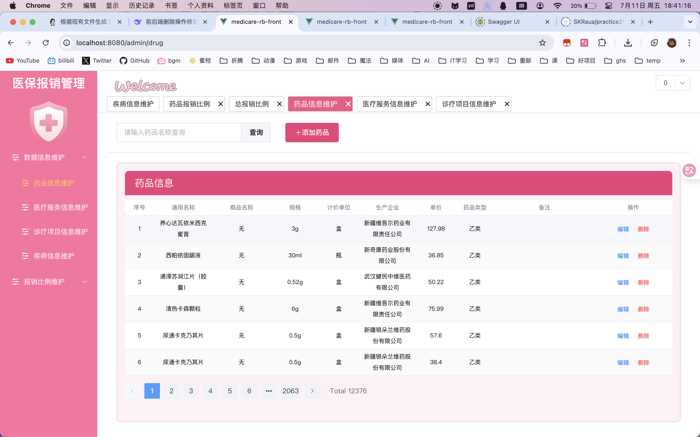

   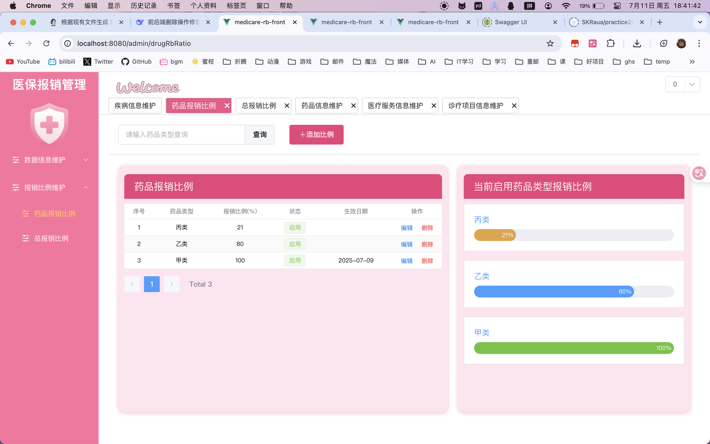

   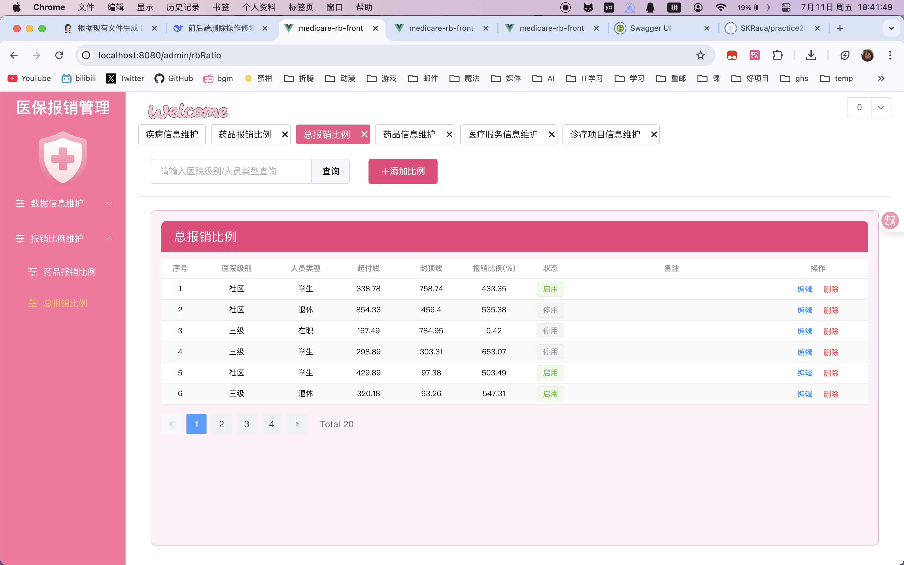

   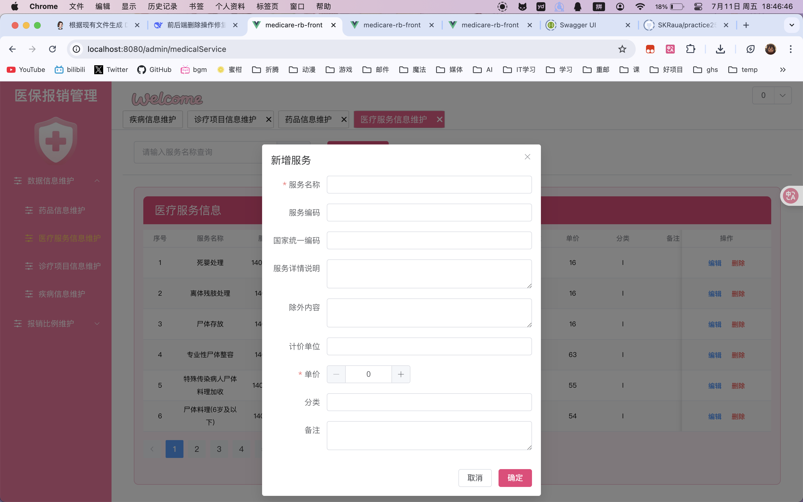

2. 医院模块

   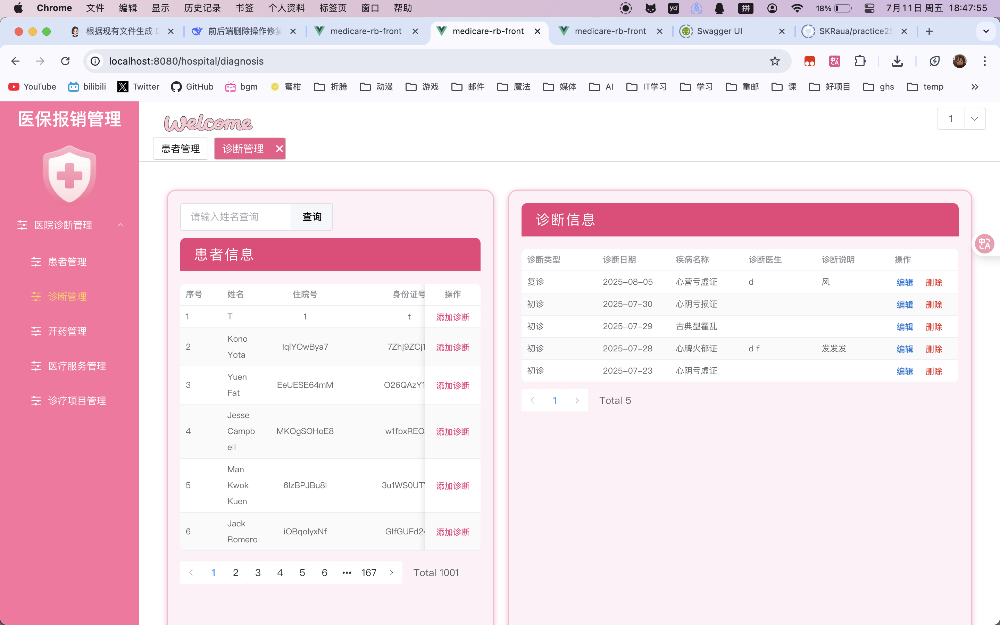

   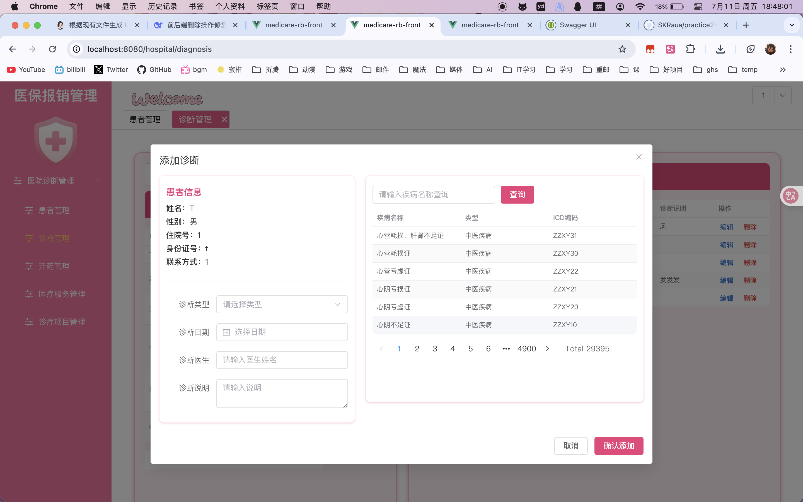

3. 报销管理

   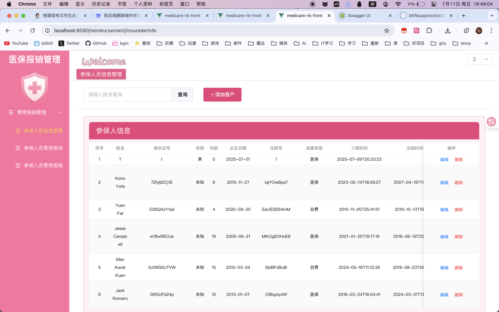

   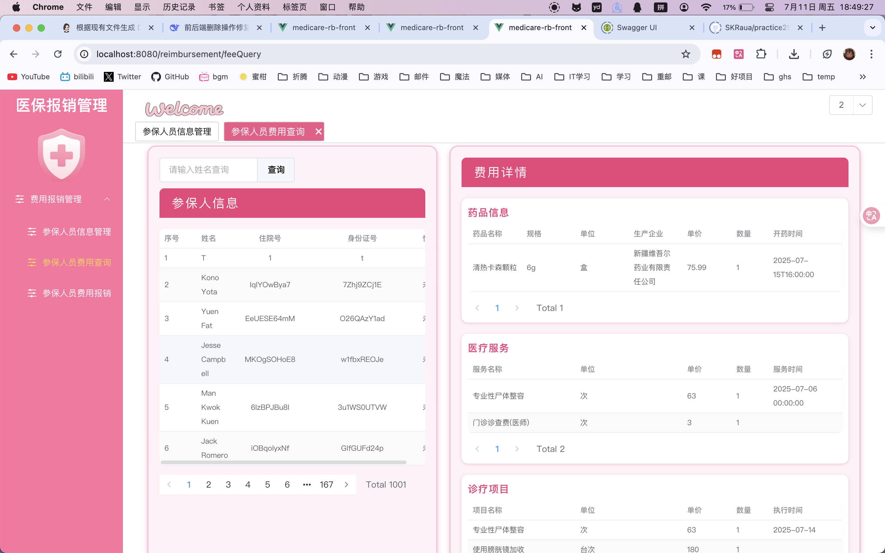

   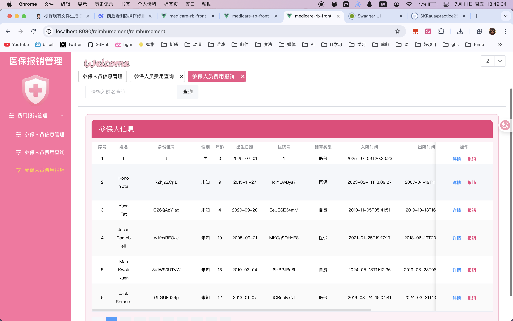

   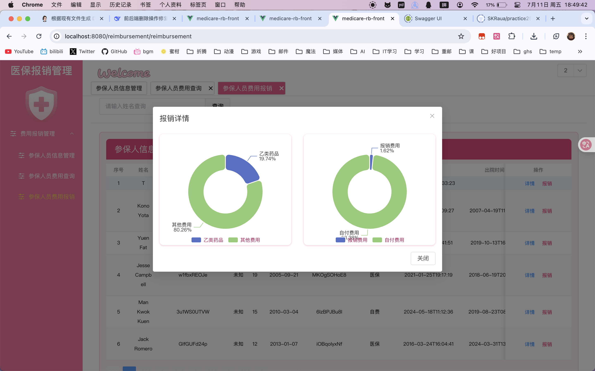

   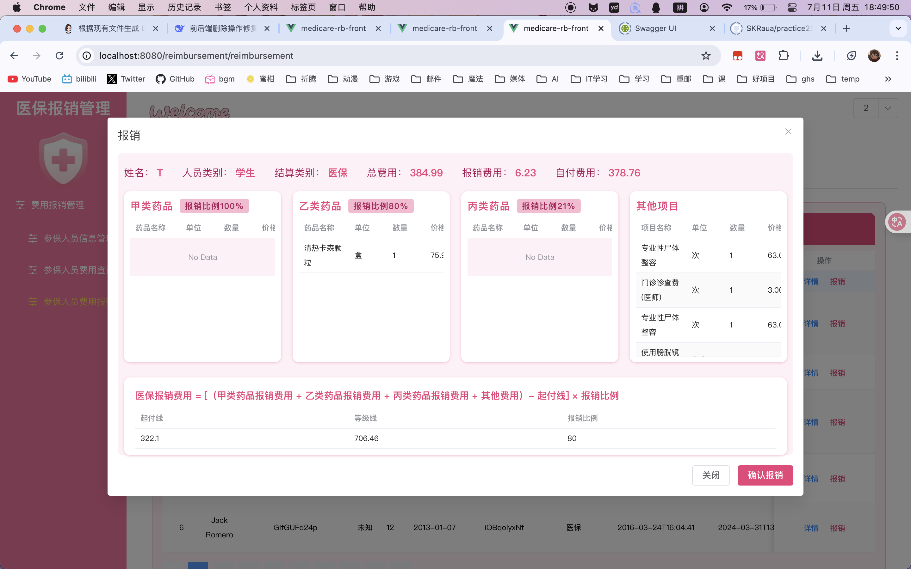

_文档最后更新：2025 年 7 月 16 日_

---

**祝您使用愉快！如果觉得项目有用，请给个 ⭐ Star 支持一下**
